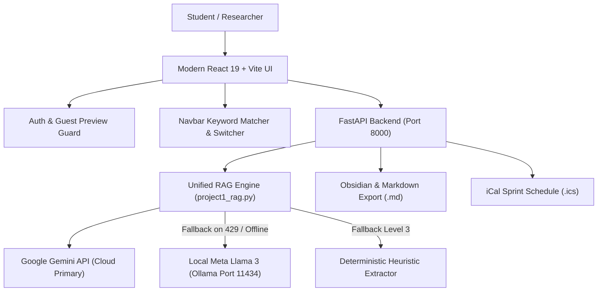

# 🎓 StudyAI Platform — Multi-Modal Academic Intelligence & Research Engine

[](https://react.dev/)
[](https://vitejs.dev/)
[](https://fastapi.tiangolo.com/)
[](https://www.python.org/)
[](https://ollama.com/)
[](https://ai.google.dev/)

An enterprise-grade, privacy-first academic study intelligence and automated pair-programming workspace. Built with a **resilient hybrid Cloud-Local inference pipeline** (Google Gemini Flash/Pro + local offline Ollama Llama 3), multi-modal OCR vision, active-recall flashcards, automated Mermaid concept flowcharts, Obsidian Markdown desktop synchronization, and cross-platform Wi-Fi accessibility.

---

## 🌟 Architecture & Key Features



---

## 🚀 The 5 Core Dashboard Modules

### 1. 🧠 AI RAG Studio (`report.jsx`)
- **Strict Protocol Enforcement**: Generates high-yield academic outputs with automated response sizing (7-line diagnostic summary or 5-line custom prompt execution).
- **Automated Concept Flowcharts (`FlowchartView.jsx`)**: Transforms complex chapters into zoomable, hierarchical Mermaid.js dependency diagrams.
- **Active-Recall 3D Flip Flashcards (`QuizFlashcards.jsx`)**: Interactive double-sided cards and self-grading quizzes engineered for spaced repetition.
- **Web Speech Audio Tutor**: Real-time text-to-speech audio playback with adjustable playback speeds (1x, 1.25x, 1.5x, 2x).
- **Calendar Sprint Generation (`StudySchedule.jsx`)**: 1-click export of structured study milestones to Google Calendar, Apple Calendar, and Outlook via standard `.ics` format.

### 2. 🔬 Gemini Deep Research Notebook (`ResearchMode.jsx`)
- **Unrestricted Academic Reasoning**: In-depth literature reviews and multi-document synthesis across all uploaded study materials.
- **Resource-Grounded Question Suggestions**: Intelligently inspects uploaded materials to recommend contextual research questions (e.g. *"Synthesize core theorems from [Doc]"*, *"Contrast methodology between [Doc 1] and [Doc 2]"*).
- **Saved Research Briefs Archive**: Dedicated library allowing users to save research findings to `localStorage`, search past briefs, inspect full reading reports in an expansive modal, or export them directly as notes.
- **Multi-Destination Export**: 1-click export of research reports to **Important Notes** (Obsidian sync) and the **50-Item Resource Hub**.

### 3. 📂 50-Item Multi-Resource Hub (`ResourceHub.jsx`)
- In-memory and disk-grounded context storage supporting lecture PDFs, raw mathematical equations, and research URLs.
- Real-time search and filter metrics across all uploaded study assets.
- Live context feeding into both Gemini and local Llama 3 models.

### 4. 📋 Standard Task & Sprint Manager (`StandardTaskManager.jsx`)
- Full academic Kanban and GTD productivity manager with priority ratings (`High`, `Medium`, `Low`), categories, and due dates.
- **AI Task Prioritization Plan**: 1-click AI generation that breaks down study milestones into an actionable 3-phase execution roadmap.
- Persistent local task state with instant Obsidian Markdown synchronization.

### 5. 📝 Important Notes Hub (`ImportantNotes.jsx`)
- Tagged scratchpad with pinning capabilities for high-priority exam formulas.
- **AI Notes Synthesizer**: 1-click consolidation of all notes into high-yield exam takeaways.
- **Auto-Sync to Desktop Vault**: Automatically writes formatted notes with YAML frontmatter to `backend/notes_export/study_workspace_notes.md`.

---

## 🛡️ Authentication & Guest Preview Security
- **Guest Preview Mode**: Unauthenticated visitors can freely browse, explore layouts, switch tabs, and hover over controls.
- **Action Guarding**: Write operations, AI generations, deep research queries, and document uploads are intercepted to prompt for authentication.
- **Interactive Password Visibility**: Eye button toggle (`Eye` / `EyeOff`) to reveal or obscure passwords during entry.
- **Forgot Password Workflow**: Integrated self-service recovery flow to verify email, reset passwords, and immediately route to the dashboard.
- **Session Memory**: Secure `localStorage` persistence keeping users signed in across visits.

---

## 🎨 Design & Theme Aesthetics
- **Pure OLED Dark Mode**: Sleek `#000000` / `#080a10` background with glassmorphism panels (`backdrop-filter: blur(16px)`).
- **Crisp Light Mode**: High-contrast, publication-grade typography with clear visibility across headings and cards.
- **Forward-Only Carousel (`carsoul.jsx`)**: Seamless continuous looping carousel showcase without backward snapping.
- **Context-Aware Navbar Search**: Integrated keyword matcher that navigates to the requested tool on `Enter` (e.g., typing *"gemini deep research"* or *"tasks"* jumps directly to that module).
- **Educational Modal Footer (`footer.jsx`)**: 100% opaque, high-contrast modal dialogs explaining local Ollama, dual-engine fallback, and zero-telemetry architecture with full attribution.

---

## ⚙️ Quickstart & Local Installation

### Prerequisites
1. **Node.js** (v18+) & **npm**
2. **Python** (v3.10+)
3. **Ollama** installed with `llama3` downloaded (`ollama run llama3`)

### 1. Clone Repository
```bash
git clone https://github.com/sarthakmishra200906-source/react_dev_p.git
cd react_dev_p
```

### 2. Backend Setup
```bash
cd project-1/backend
pip install fastapi uvicorn pypdf python-dotenv
# Configure your Gemini API key in .env
echo "GEMINI_API_KEY=your_gemini_api_key_here" > .env
# Start FastAPI backend
python -m uvicorn main:app --host 127.0.0.1 --port 8000 --reload
```

### 3. Frontend Setup
```bash
cd ../  # Navigate to project-1
npm install
# Start Vite with cross-device Wi-Fi hosting
npm run dev -- --host 0.0.0.0
```

### 4. Local Ollama Engine
```bash
ollama run llama3
```

### 5. Access Endpoints
- **Local Web App**: `http://localhost:5173/`
- **Wi-Fi Mobile/Cross-Device**: `http://192.168.31.18:5173/`
- **FastAPI Backend Swagger**: `http://127.0.0.1:8000/docs`
- **Ollama Engine**: `http://localhost:11434/`

---

## 📊 Model Quotas & Worst-Case Simulation Summary

| Engine | Rate Limit (RPM) | Daily Quota (RPD) | Worst-Case Exhaustion Time | Recovery Cycle |
| :--- | :--- | :--- | :--- | :--- |
| **Gemini 2.5 Flash** | 15 RPM | 1,500 RPD | ~100 Minutes (continuous spam) | 60s (RPM) / 00:00 PST daily (RPD) |
| **Gemini Pro** | 2 RPM | 50 RPD | ~25 Minutes | 60s (RPM) / 00:00 PST daily (RPD) |
| **Local Ollama Llama 3** | Unlimited | Unlimited | Never (Hardware queueing only) | Instant (0-5 seconds) |
| **Diagnostic Fallback** | Unlimited | Unlimited | Never | Instant |

*For complete technical analysis, see the private report file `reportmodel.md`.*

---

## 📂 Repository Structure

```text
react_dev_p/
├── .gitignore                          # Global git ignores
├── README.md                           # Master Project Documentation
├── reportmodel.md                      # Private local AI quota stress report
└── project-1/
    ├── package.json                    # Frontend dependencies (React 19, Lucide, Vite)
    ├── vite.config.js                  # Vite server & proxy configurations
    ├── backend/
    │   ├── main.py                     # FastAPI application & REST routing
    │   ├── rag/
    │   │   └── project1_rag.py         # Dual-engine RAG pipeline & LLM fallback
    │   └── notes_export/               # Auto-synced Obsidian Markdown files
    └── src/
        ├── App.jsx                     # Core application orchestrator & routing
        ├── index.css                   # Global design tokens, dark mode, glassmorphism
        └── components/
            ├── LandingPage.jsx         # Landing page & feature showcase
            ├── Dashboard.jsx           # Master studio workspace & guest guards
            ├── AuthModal.jsx           # Sign In, Register, Eye toggle, Forgot Password
            ├── carsoul.jsx             # Forward-only continuous carousel
            ├── report.jsx              # AI RAG Studio (flowcharts, quizzes, speech)
            ├── ResearchMode.jsx        # Gemini Deep Research & Saved Briefs Library
            ├── ResourceHub.jsx         # 50-Item Multi-Resource Hub
            ├── StandardTaskManager.jsx # Academic task & sprint manager
            ├── ImportantNotes.jsx      # Notes hub with Obsidian sync
            ├── ChatDrawer.jsx          # Global interactive AI tutor drawer
            ├── FlowchartView.jsx       # Mermaid.js concept dependency graphs
            ├── QuizFlashcards.jsx      # 3D interactive flip flashcards
            ├── StudySchedule.jsx       # iCal sprint calendar sync
            ├── header.jsx              # Top brand header component
            └── footer.jsx              # Educational modals with zero direct routing
```

---

## 📜 License & Acknowledgments
- **Google DeepMind**: Gemini 2.5/1.5 Flash multimodal models.
- **Meta AI**: Open weights for Llama 3 8B.
- **Ollama**: Local containerized LLM inference engine.
- **Mermaid.js**: Open-source diagrammatic vector rendering.
- **Obsidian**: Personal knowledge management standard for Markdown notes.
